

# The Decentralized Lottery
##### Created by **Demi Oyebanji**, **Anna Toaze**, **Daniel Froom**, **Ana Cano**, and **Suleiman Abdul Samad** as a project for the **UofT SCS Financial Technology Bootcamp**

_____________________________________________________________________________________________________

If you're inspired by our code please find a way to credit us by name :)
If you'd like to hire our team or use this for research/ commercial purposes, please reach out by email.

**CLICK NAME BELOW TO EMAIL**:

[Daniel Froom](mailto:danifroom@gmail.com),
[Demi Oyebanji](mailto:oluwademiladeoyebanji@outlook.com),
[Ana Cano](mailto:anacanoht@gmail.com),
[Anna Toaze](mailto:anna.tz@live.com),
[Suleiman Abdul Samad](mailto:issakdanlity@gmail.com),

_____________________________________________________________________________________________________
 
### Project Overview

The premise of Lottix can be understood best by understanding the two user types on the platform: **whales** and **players**

**Whales** are users with a large bankroll of crypto assets (such as ethereum) looking to gain more income passively.

**Players** are people willing to take a gamble in order to win large crypto assets

Lottix uses blockchain technology to create an efficient lottery system by allowing **whales** to set up private lottery pools based on real-world lottery winning numbers. The **whale** can stake a certain amount of crypto (right now ethereum) and our platform will 'generate' them a crowdsale which allows 'lottery tickets' or **'TIX'** to be purchased by **players**. 

To get a better idea of our group plan. Check out some of the assets in our **Resources** folder:

[Presentation Slideshow](Resources/Slideshow.pdf)

[Brainstorm](Resources/LOTTIX.pdf)

[Parameter Plan](Resources/TIX.xlsx)

### Project Breakdown

Our project breakdown includes three levels:
* Our front-end design in **React** 
* Our back-end code in **Solidity**
* Testing the back-end in **RemixIDE** 

The **React** code was written by **Demi Oyebanji** with help from **ChatGPT**. [RoutingJSX](React_Files/src/App.jsx)

The **Solidity Contracts** were written by:

**Anna Toaze**:
* [ERC20 Token and functionalities](Solidity_Files/TIXMINTER.sol)
* [Interface for Tix Token](Solidity_Files/TixInterface.sol)
      
**Ana Cano**:
* [Crowdsale Contract and Capabilities](Solidity_Files/Lottix.sol)
* [ERC20 Token and functionalities](Solidity_Files/TIXMINTER.sol)
      
**Daniel Froom**:
* [Guess Matching and Winner Payout Capabilities](Solidity_Files/set_winner_payout.sol)
* [Whale Lottery Selection and Storage](Solidity_Files/GenerateNewLottery.sol)
      
**Demi Oyebanji**:
* [Crowdsale Factory and Functionalities](Solidity_Files/WhaleContract.sol)
* [Whale Lottery Selection and Storage](Solidity_Files/GenerateNewLottery.sol)
* [Interface for Lottery Picks](Solidity_Files/ILotteryInterface.sol)
* [Interface for Whale Functions](Solidity_Files/IWhaleInterface.sol)

**Suleiman Abdul Samad**
* [Interface for Whale Functions](Solidity_Files/IWhaleInterface.sol)

All members took part in troubleshooting, problem solving, research and integration of all the code.

#### User Journies
Let's take a look at out platform from the perspective of our prospective users. Every journey begins by signing into our Dashboard which should have certain information about a user saved:
* The wallet address they used to sign in
* Their previous interactions with the blockchain as a **whale** or **player**
* Important notifications about action that they should take

With this information in hand the users have less hassle when taking part in any of our DApp functionalities like making a new lottery, buying a ticket or collecting winnings. 

##### Whale Journey

The whale's journey begins on the [Whale Dashboard](React_Files/src/Whale.jsx).

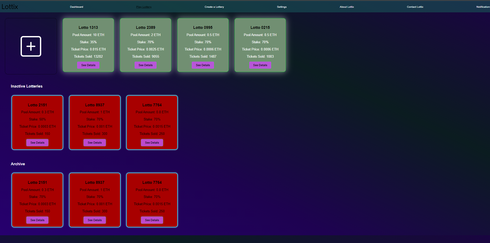

Here, they can see their active, expired and archived lotteries as well as get more details about them such as the:
* Amount Invested
* Stake in the Lottery
* Ticket Price
* Tickets Purchased
* and more

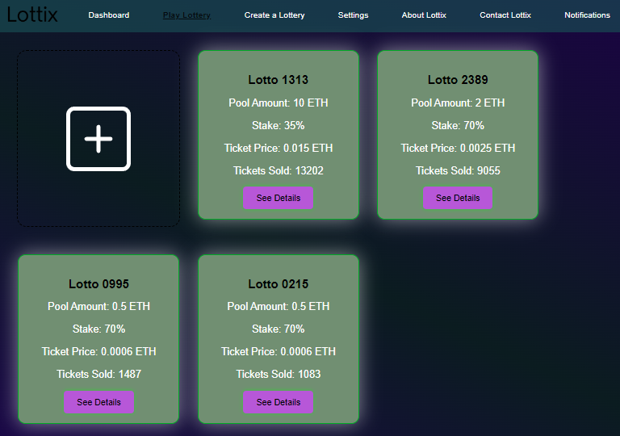

Their active lottery section also includes a dynamic button to add a new lottery which sends them to a page that lists available lottery packages with details like the investment amount required, dividend breakdown and more. 

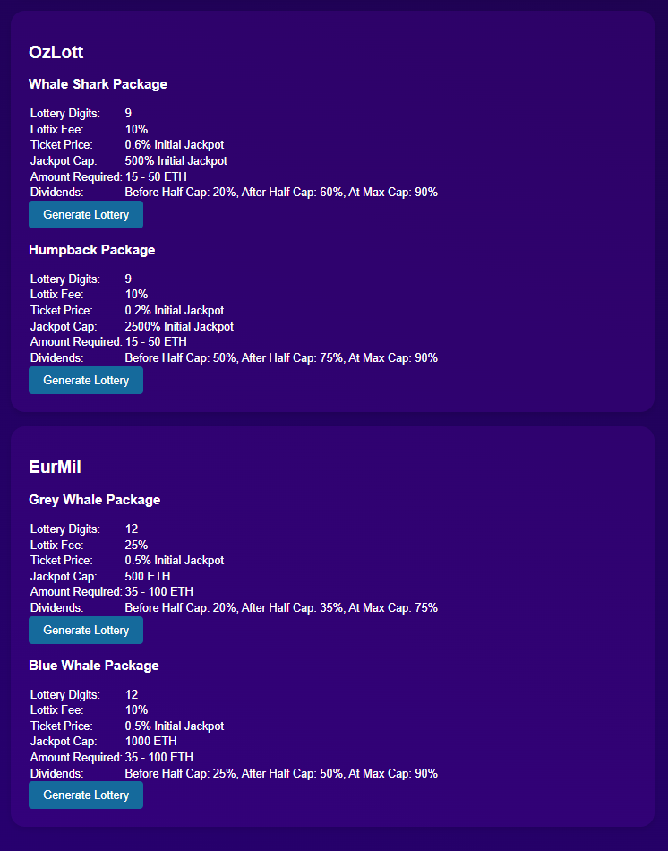

By clicking the 'Generate Lottery' button they would generate a [Form](React_Files/src/NewLotteryForm.jsx) which asks them for the amount they would like to deposit into a New Lottery of that type. When they submit the form, the form passes their address and their package selection to the smart contract in Solidity where the magic can begin. 

Here's the front-end whale journey from the top before we go further:

<video width="180" height="300" controls>
  <source src="Resources/Grabs/WhaleJourney.mp4" type="video/mp4">
  Your browser does not support the video tag.
</video>

In the **back-end:**

The new lottery request is received in Solidity by the [Generate New Lottery](Solidity_Files/GenerateNewLottery.sol) Solidity file. 

In this file, a smart contract exists for each possible lottery that Lottix offers. Here's an example for the **EuroJackpot Lottery** nicknamed **EuroJack**

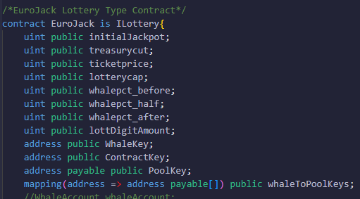

Each lottery includes a function called **invest** which takes a user's package selection and an amount to be invested as arguments then sets the parameters for their lottery accordingly.

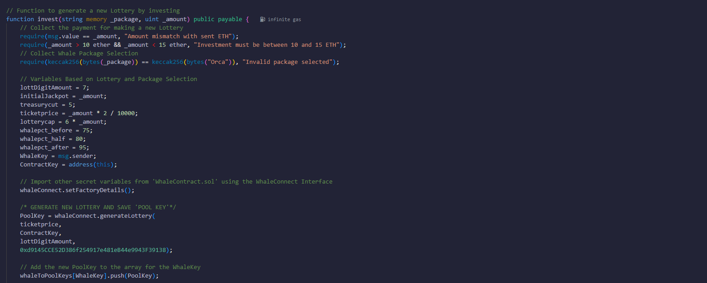

Once the parameters are set. The contract then calls the **generate_lottery** function from the [Crowdsale Factory File](Solidity_Files/WhaleContract.sol) by passing the required functions (ticket price, key to the whale contract, amount of digits in a lottery and the proper address for the ERC20 TIX token which will be used for the crowdsales). Here's what that function looks like in the Factory File:

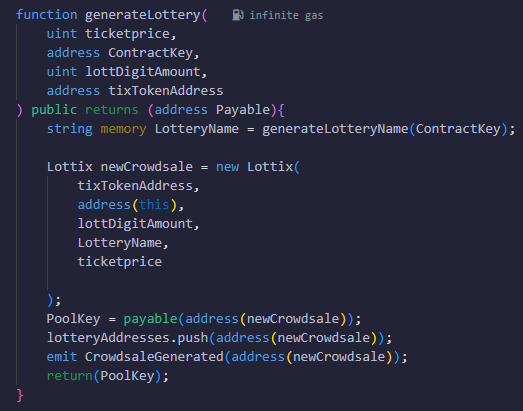

Did you see it? If you're a solidity dev you're already rolling your eyes but yes inside this function we call ANOTHER solidity contract in. The [Lottix Contract](Solidity_Files/Lottix.sol) is the template that the Factory uses when it generates a new Crowdsale for a Whale. It includes the general functions that let each Lottery operate like:
* Letting players buy tickets
* Removing ETH / ERCTokens in case they were sent by error (just a failsafe)

We'll take a deeper look at the **joinCrowdsale** function in the **player journey** later on but for now here's how the solidity code works in the test environment on Solidity:

We start by deploying the [ERC20 TIX Token](Solidity_Files/TIXMinter.sol)
This is our digital 'ticket' and we let **whales** use it when they make lotteries.

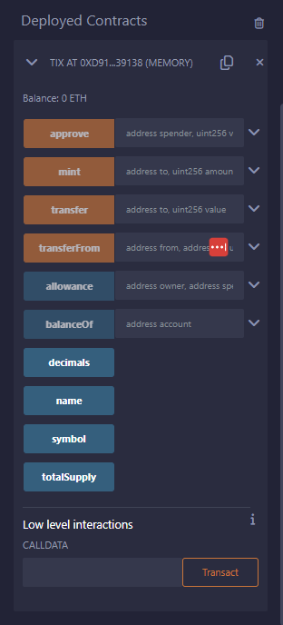

The deployed TIX token includes functions that allow us to mint more tokens, approve certain wallets to mint, transfer tokens to a certain wallet and more!

It's also important to note that the TIX token has its own Address on the blockchain when we deploy it. 

Next, we compile and Deploy the [Crowdsale Factory](Solidity_Files/WhaleContract.sol).

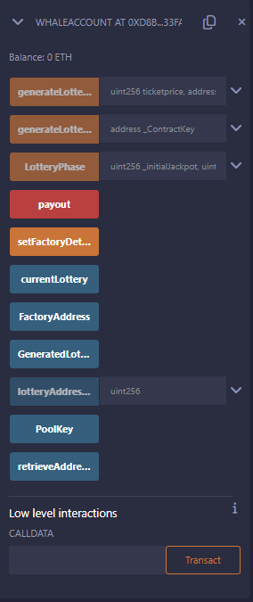

This contract includes our functions for generating a new lottery, paying out the money from ticket purchases and more!
It's also important to note that the Factory has its own Address on the blockchain when we deploy it.

Our next step will be to deploy each contract in the [Generate New Lottery](Solidity_Files/GenerateNewLottery.sol) file for the different lotteries we offer our whales. But there's something we need to do first. Now that we've generated our TIX Address and Factory Address, we'll have to pass those values on to each lottery type so they can run their functions properly. You only need to do this once when you deploy.

First we add the Whale Address to the constructor of each lottery

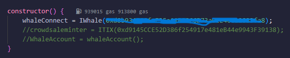

Then we pass the TIX address to the generateLottery function 

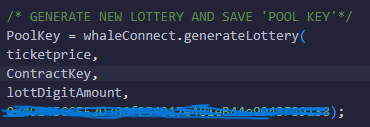

Once this is done for each contract they can all be deployed and are ready for **whales** to interact with them. 

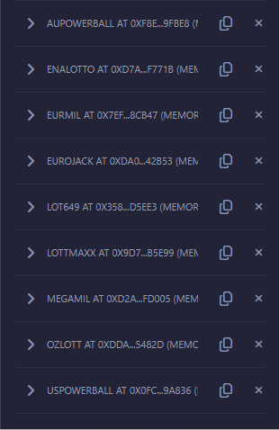

Like previously mentioned, whales can interact with the **invest** function by passing 2 parameters, the amount they want to invest, and the package they'd like to enter that lottery with. 

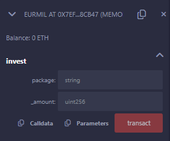

Let's go through an example of a Whale that wants to make a 50 ETH Lottery using the EuroMillions Lottery. 

The EuroMillions Lottery offers two potential packages: Grey Whale and Blue Whale. Blue Whale is the more lucrative package so let's take that. 

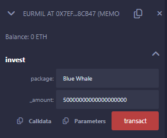

In order to Transact that function, the Whale will need to approve the 50 ETH transfer from their crypto wallet into the Crowdsale Factory. 

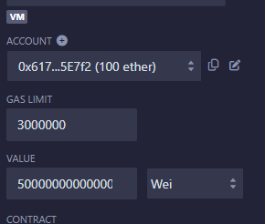

Once that's all verified. The factory will create a new Lottery with its own address and will show the proof in its calls and functions

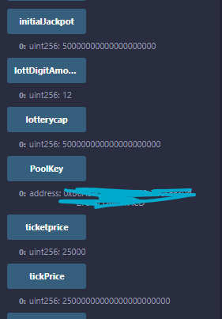

In order to see the New Lottery in RemixIDE we'll deploy a [Lottix Contract](Solidity_Files/Lottix.sol) 'at' the new Lottery Address

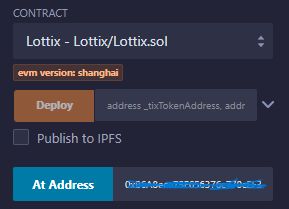

Here's what the New Lottery looks like with all its functions:

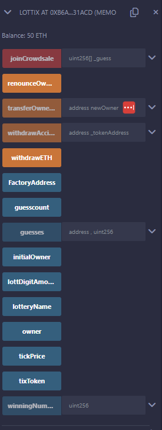

Now the lottery is live and **players** can join for a chance to win the ever increasing jackpot. 

##### Player Journey

Players have a separate page, the [Marketplace](React_Files/src/Marketplace.jsx). Here they can select from active lotteries based on stats like:
* Jackpot size
* Numbers in a guess
* Ticket Price and more!
* 
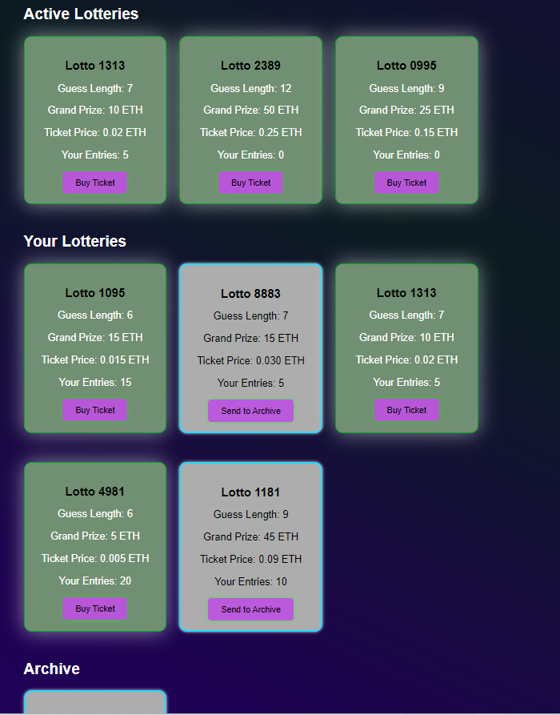

When users click 'Buy Ticket' they launch a [Form](React_Files/src/NewGuessForm.jsx) which collects their guess and passes it on to the 'joinCrowdsale' function of that Lottery in Solidity. 

Let's head back to our Lottery in Solidity to see how that would work.

**Players** are only required to submit their guesses. The front-end should allow for a low-barrier UX experience such as selecting numbers from a page or wheel of options. The front-end can then pass the guesses on to the smart contract as an array in solidity. 

Since we generated a 12-number lottery, that guess would look something like this in Solidity:
**[ "03","17","25","27","29","43","55","62","75","88","93","95" ]**

Let's go ahead and fill that in

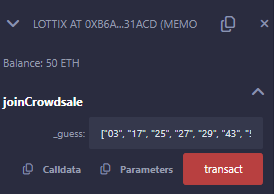

In order to submit a guess, players would have to approve a transaction at the same cost as the ticket price for that lottery

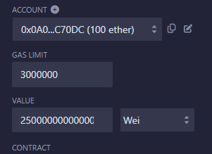

The Solidity functions include lots of failsafes to make sure that guesses and payment amounts match the correct format for the Lottery but a front-end handler like javascript or Python would do a better job at making sure the output is always in the desired array format. 

Let's hop into the code for playing the lottery and look at some of these failsafes

In the **joinCrowdsale** function, we set multiple requirement that safeguard the Lotteries and the players. Including checking the ETH value, the token balance for that lottery, the guess length, and the digits in each number guessed

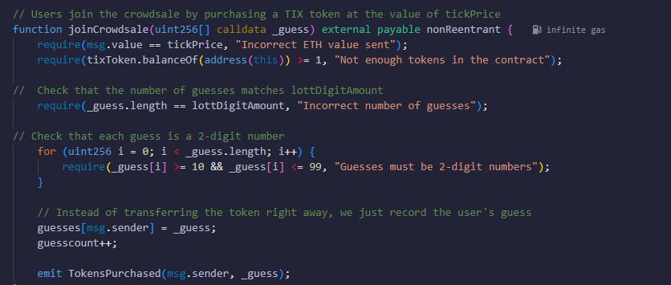

Each lottery also has emergency functions that allow us as administrators to transfer funds or tokens out if there's an error or emergency with one of the lotteries

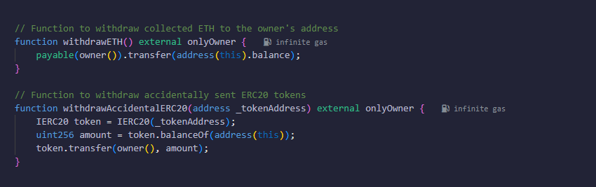

After the Lottery gets drawn (EuroMillions draws on Tuesdays and Fridays at 7:45), the winning numbers are uploaded to the blockchain and the the winner is selected by matching the winning numbers to the correct guess if it exists.
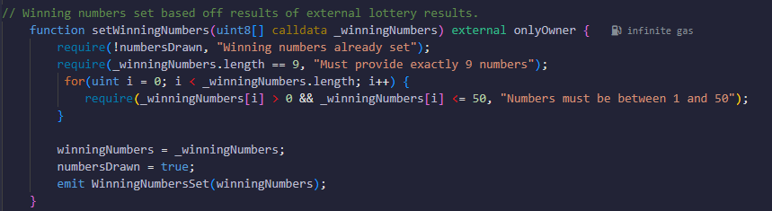
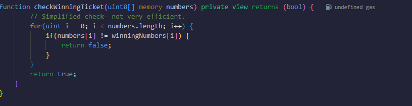

These functions can be found in the [Winner Payout File](Solidity_Files/set_winner_payout.sol)

Here's how that window looked when Deployed in Remix:

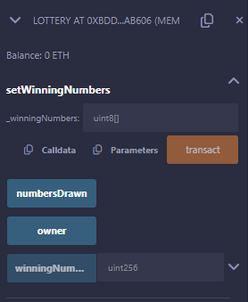

### Future considerations

**What if nobody wins?**
We planned to introduce a logic that automatically cashed out whales of the same type (orcas to orcas and blue whales to blue whales) and combined them into a 'super lottery'. Allowing the DApp to maintain the whale's funds while further incentivizing both whale and player to continue to raise the jackpot

**Gambling Regulations**
Gambling laws differ widely by country and city and operating a lottery often requires obtaining licenses from regulatory authorities. The decentralized nature of blockchain might blur jurisdictional lines, complicating compliance.

**Age and Identity Verification**
Enforcing age restrictions is a legal requirement in many jurisdictions to prevent underage gambling.
KYC (Know Your Customer) and AML (Anti-Money Laundering) regulations may require platforms to verify the identity of participants, which can be challenging in a decentralized environment.

### Other Media
Example of a Potential TIX Token

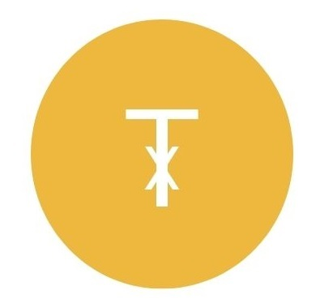

AI Generated TIX

